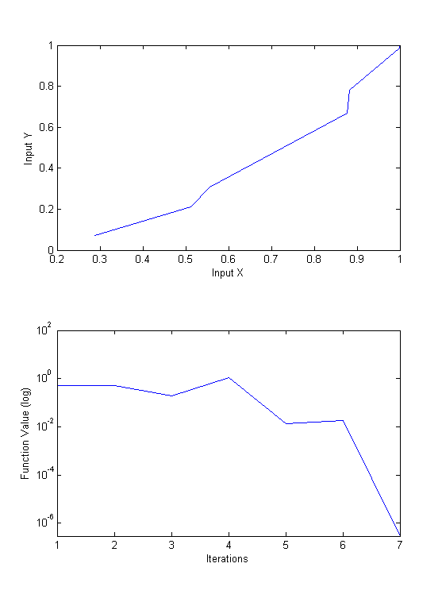

# NUS EE5904 NEURAL NETWORKS HW2 Report
by Ryan Louie, A0149643X

## Q1: a)
Using gradient descent, with a `learning rate = 0.001`, we defined convergence to the minimum where `f(x,y) = 0` when the function value was within `epsilon = 0.01` of 0.  As depicted below, the learning converges after 3099 iterations.

Using a learning rate that is too large (`learning rate = 0.1`) results in the learning diverging, where the function value is no longer decreasing over iterations.

## Q1: b)
Newton's method is a huge improvement over gradient descent.  The learning converges in as little as 7 iterations. Looking at the top axes describing the change in weights in the 2-D space, we can see that large jumps in `(X,Y)` are achieved that progress closer to where the function minimum is located at `(1,1)`,

## Q1: code
    % part a: steepest gradient descent
    lr = 0.001;
    runway = 10^6;
    epsilon = 0.01;
    w = rand(runway, 2); % weights are also input x,y
    out = zeros(runway,1);
    iter = 1;
    newton = true; # newtons method or not; toggle for part a) or part b)

    % first out
    out(iter,1) = rosenbrock_valley(w(iter,1), w(iter,2));
    while out(iter,1) > epsilon
        if newton
            H = rosenbrock_valley_hessian(w(iter,1), w(iter,2));
            g = rosenbrock_valley_gradient(w(iter,1), w(iter,2));
            delta_w = (-inv(H)*g')';
        else
            % gradient descent
            g = rosenbrock_valley_gradient(w(iter,1), w(iter,2));
            delta_w = -lr*g;
        end
        
        w(iter+1,:) = w(iter,:) + delta_w;
        iter = iter + 1;
        out(iter,1) = rosenbrock_valley(w(iter,1), w(iter,2));
    end

    % how many iterations
    iter
    % how close of a solution
    solution = w(iter,:)

    clf;
    subplot(2,1,1)
    plot(w(1:iter,1), w(1:iter,2))
    xlabel('Input X')
    ylabel('Input Y')

    subplot(2,1,2)
    semilogy(out(1:iter))
    xlabel('Iterations')
    ylabel('Function Value (log)')
    ylim([0 100])

The functions to compute the function value, gradient, and hessian of Rosenbrock's Valley are defined as follows

    function out = rosenbrock_valley(x,y)
        out = (1 - x)^2 + 100*(y-x^2)^2;
    end

    function g = rosenbrock_valley_gradient(x,y)
        % gradient equations found at
        % http://www.mme.wsu.edu/~grantham/papers/TF/cdc03_frm111.pdf
        a = 100;
        g = zeros(1,2);
        g(1,1) = 4*a*x*(x^2-y) + 2*(x-1);
        g(1,2) = -2*a*(x^2 - y);
    end

    function H = rosenbrock_valley_hessian(x,y)
        % hessian equations found at
        % http://www.mme.wsu.edu/~grantham/papers/TF/cdc03_frm111.pdf
        a = 100;
        H = zeros(2,2);
        H(1,1) = 12*a*x^2 - 4*a*y + 2;
        H(1,2) = -4*a*x;
        H(2,1) = -4*a*x;
        H(2,2) = 2*a;
    end

## Q2: a)

## Q3: a)
## Q3: b)
## Q3: c)
## Q3: d)
## Q3: e)
## Q3: f)

